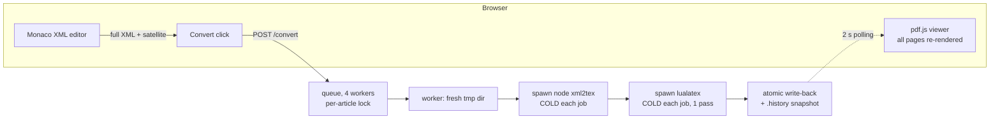
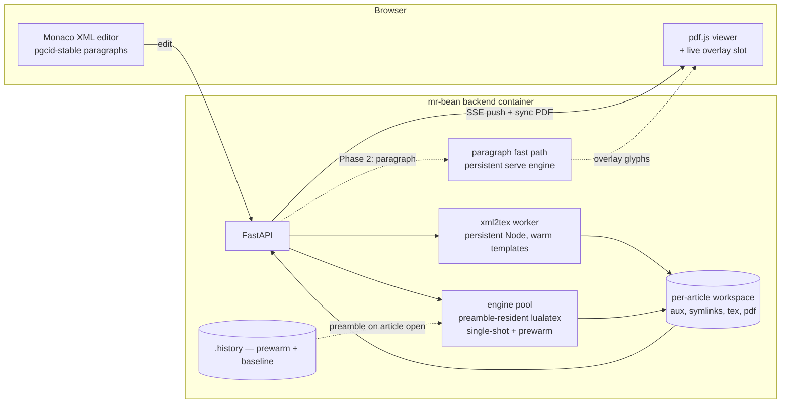

# PGC Editor (mr-bean): from 20 s conversions to live editing

Architecture and phased plan for integrating the real-time LuaTeX system
into the production XML→TeX→PDF editor. Based on a four-way code survey of
`/data/neopage/repos/mr-bean` (backend pipeline, popeye/xml2tex, frontend,
ops) conducted 2026-07-22, plus the measurements in this repo's
`prototype/` and `notes/`.

---

## 1. Current state — where the ~20 seconds goes

Every conversion is **cold-start × everything** (`compiler.py:105-163`):

| Stage | What happens per job | Cost structure |
|---|---|---|
| workspace | fresh `TemporaryDirectory`, images re-symlinked | small |
| xml2tex | **new Node process** per job; 1.x additionally imports saxon-js (2.4 MB) and — due to an un-awaited `shouldReprocess()` at `xml2tex/index.js:2324` — **recompiles its peggy templates every run**; full-document DOM sweeps ×40 + 57 whole-string regex passes | seconds, mostly avoidable |
| lualatex | **new engine** per job: format load, luaotfload, full template preamble (**13.1 s measured** on these exact stacks — notes/07), then full-document typeset; exactly one pass (`compiler.py:283-304`) | dominant, mostly avoidable |
| write-back | atomic replace + `.history` snapshot | small |
| delivery | frontend polls `/jobs/{id}` every ~2 s (SSE endpoint exists but is a stub); viewer then reloads the **entire PDF**, re-rendering every page, losing scroll position | +2–4 s perceived |

Nothing is reused between jobs: no aux, no workspace, no warm process, no
format. Per-stage telemetry already exists (`JobTimings{imageLinkMs,
xml2TexMs, tex2PdfMs}`, `job_store.py:14-18`) — production numbers are one
query away.

## 2. Why our existing work drops in cleanly

Everything proven in `prototype/` maps onto seams that already exist:

| mr-bean fact (evidence) | What it enables |
|---|---|
| Single clean compile seam `_run_lualatex` (`compiler.py:283`) | drop-in replacement by a **warm engine pool** (our `converge-loop.lua`, single-shot preamble-resident engines: 18 s → ~3 s measured) |
| Customer + jid/aid resolved **before enqueue** (`main.py:217`) | engine pool keyed early; prewarm on article open |
| Per-article lock already serializes compiles (`compiler.py:97-103`) | exactly the invariant per-article engines need |
| `.history/` keeps complete `(xml, satellite, tex, pdf, log)` tuples | **prewarm source**: the last `.tex` gives the exact preamble to make resident before the user's first convert |
| xml2tex2.0 `transformXml()` is an importable async function (`src/server.js:103`) | **persistent Node conversion worker** — kills the spawn + template-compile cost |
| `pgcid` → `\paraid{}`; 2.0 numbering is **idempotent** (`paragraphNumberingProcessor.js:40-68`) | **stable paragraph identity across edits** if `pgcid` is stamped in the XML at load — the keystone for the live fast path |
| pdf.js viewer has a per-page `overlay` slot with pt→px conversion (`PDFPage.tsx:291-307`) | our live paragraph overlays port 1:1 |
| Cursor→enclosing-tag resolution exists (`EditorPane.tsx:88-207`) | cursor→paragraph identity for the fast path |
| `/events` SSE channel is open but unused (`useSSE.ts`) | push results; remove the 2 s poll floor |
| `/convert` can already return `application/pdf` synchronously (`conversionApi.ts:28-31`) | fast compiles can skip the job/poll machinery entirely |

Container reality: everything runs in the one `mr-bean-backend` container
(neopage:v10, preloaded TeX). Host 12 CPU / 15 GiB, **no resource limits
set**; ~10 GiB headroom. Deploys do `compose down -v`, so engine warm-up
must be part of container startup. There are **no backend tests for the
compile path** — the integration brings its own.

## 3. Target architecture

The compile pipeline becomes **warm at every stage**, and (Phase 2) gains
the paragraph fast path beside it — the same three-tier consistency model
validated in `prototype/`: instant paragraph → seconds-fresh pages → true
PDF.

## 4. Phased plan

### Phase 0 — measure (½ day, no code)
Pull `JobTimings` from recent production jobs to attribute the 20 s between
`xml2TexMs` and `tex2PdfMs` per customer. Everything below assumes the
split is roughly (4–6 s xml2tex : 13–16 s lualatex); the plan reorders
itself if reality differs, and this baseline is the before/after evidence.

### Phase 1 — warm pipeline: 20 s → target 4–6 s (fits the 5–8 s goal)

1. **Warm lualatex engine pool** (the big win, ~-12 s)
   - Port `prototype/demo/server.py`'s ConvEngine/pool + `engine/converge-loop.lua`
     into a small Python module used by `_run_lualatex`.
   - Key: `(customer, typesetmodel, pdfMode, draft, showFrame)` — the
     preamble mutations at `compiler.py:132-141` demand it; the common key
     (proof, non-draft) stays hot.
   - Prewarm: on `GET /dataset/{jid}/{aid}` (article open), extract the
     preamble from the newest `.history` `.tex` (or dataset `.tex`) and
     warm an engine before the first convert. Also warm the default key at
     container start (compose `command` hook — deploys wipe warm state).
   - Single-shot engines + background refill (validated: template float
     machinery leaks state across body re-runs; first-run semantics are
     byte-identical). Real PDF finalized by graceful quit — drain stdout
     (the pipe-block lesson).
   - Success detection must not be "PDF exists" (`compiler.py:298`) — in a
     persistent workspace a stale PDF always exists; use the engine's
     CONVDONE + fresh-file check. Keep "lualatex" in error text for
     `error_tool` classification.
2. **Persistent per-article workspace** (enables 1 and aux convergence)
   - Replace `TemporaryDirectory` (`compiler.py:111`) with a managed dir
     per `(customer, jid, aid)` under a cache root; refresh image symlinks
     (fix the skip-if-exists staleness at `compiler.py:479-480`);
     idle-reap + LRU like the prototype's session manager.
3. **Persistent xml2tex worker** (~-2–4 s)
   - 2.0 path: long-lived Node process importing `transformXml()`; simple
     line-protocol or HTTP on localhost; `DEFAULT_TEMPLATE_PATH` at start.
   - 1.x path: fix the un-awaited `shouldReprocess()` (`index.js:2324`) —
     a one-line bug that alone removes per-run template recompilation —
     then wrap `browserInit` in the same worker (its globalThis state means
     one conversion at a time per worker; run N workers).
4. **Delivery latency** (~-2 s perceived)
   - Publish job transitions on the existing `/events` SSE stream; keep
     polling as fallback.
   - When the compile finishes fast, return the PDF synchronously on
     `/convert` (the frontend path already exists).
5. **Viewer continuity** (perceived speed, no engine work)
   - Drop the full-viewer blur overlay; keep old pages interactive with a
     slim progress indicator; restore scroll offset (not just page) after
     swap; render only visible pages (virtualize) on reload.
6. **Tests + rollout**
   - Golden test: same article XML → byte-compare warm-path PDF/tex vs
     cold-path output (normalize the known `?v=<timestamp>` nondeterminism
     in math image URLs).
   - Feature flag (`WARM_ENGINES=1`) with automatic fallback to the cold
     path on any engine failure (the prototype's fallback pattern).
   - Add explicit `mem_limit` to compose; budget: 4 workers × ~1–1.5 GiB
     resident engine + pool ≈ fits the ~10 GiB headroom; reuse
     RT_POOL/RT_SESSIONS/RT_IDLE_MIN-style knobs.

Expected result: xml2tex ~0.5–2 s (warm) + lualatex ~3–4 s (body-only on
these doc sizes; 10.1 s was a 16-page Elsevier article, typical journal
articles land ~3 s) + write-back ≪1 s + push delivery ≈ **4–6 s end-to-end**.

### Phase 2 — live editing (the prototype's full model in production)

1. **Stable paragraph identity**: stamp `pgcid` into the XML at document
   load (frontend or a load-time backend pass); 2.0's idempotent numbering
   then preserves them across edits; port the 5-line idempotency guard to
   1.x `XmlProcessor.js:214-222`. This makes `\paraid` stable — the
   contract our capture/fast-path/page-cache stack keys on.
2. **Paragraph fast path service**: the prototype's serve engine + context
   capture runs beside the pool in the backend container; on keystroke,
   frontend resolves the enclosing paragraph (extend the existing
   tag-at-offset code), converts just that element via the warm xml2tex
   worker (2.0's `_processNode` on the cached annotated DOM), and
   recompiles the fragment (~10–20 ms measured on production templates).
3. **Live overlays in the viewer**: render fast-path glyph boxes /
   dim-masks into the existing per-page `overlay` slot (pt × zoom); push
   via SSE; converged pages then swap in from the Phase-1 pipeline.
4. **Boundary policy** (from prototype validation): footnote, display-math,
   list-wrapped, citation-bearing paragraph edits skip the fast path and
   ride the (now 4–6 s) full pipeline — silently correct, never wrong.

### Explicitly out of scope for now
Galley re-cut (sub-second repagination) — research milestone; horizontal
scaling / external job store (docs' own roadmap note) — orthogonal.

## 5. Risks and mitigations

| Risk | Mitigation |
|---|---|
| Warm-path output differs from cold path | golden byte-compare gate per customer before enabling flag; fallback always available |
| Preamble variant explosion (mode/draft/showframe) | pool keyed by variant; only common variants prewarmed; others fall back cold |
| Memory pressure (no cgroup limits today) | explicit `mem_limit`, idle reaper, RT_POOL=1 fallback profile |
| 1.x globalThis state in a persistent worker | one conversion per worker at a time (mirrors current per-article lock); or migrate Elsevier to 2.0 (owner decision) |
| Deploys wipe warm state (`down -v`) | warmup in compose `command`; prewarm-on-open covers the rest |
| Stale PDF masquerading as success | engine CONVDONE + output freshness check replaces "PDF exists" |
| No existing compile tests | golden tests land in Phase 1 step 6 before the flag flips |

## 6. Decision points needing owner input

1. Phase 0 numbers: confirm the xml2TexMs/tex2PdfMs split from production.
2. Elsevier path: fix + keep 1.x, or accelerate migration to 2.0?
3. Where `pgcid` stamping lives (load-time backend pass vs frontend).
4. Memory budget / expected concurrent articles per backend instance.
5. Phase 2 UX: is the three-tier consistency model (instant paragraph →
   fresh pages in seconds → true PDF) acceptable to operators?
