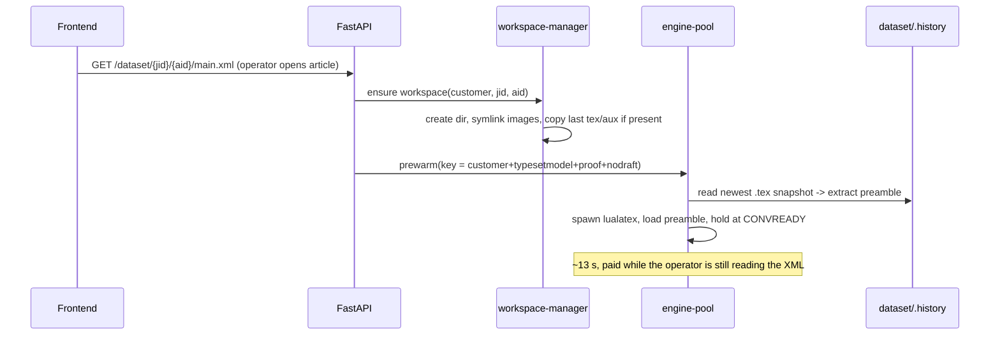
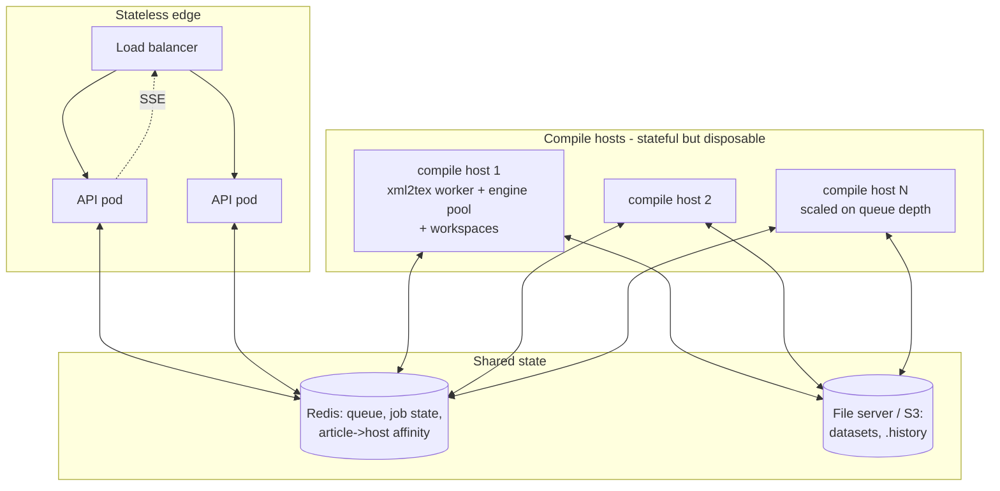

# Phase 1 design — warm pipeline for xml2tex2.0 customers (ACS, Sage, …)

Scope: non-Elsevier path only (`xml2tex2.0` + simba templates). Elsevier/1.x
untouched — it keeps today's cold path until its own decision is made.
Target: 20 s → 4–6 s per convert, without changing output fidelity.

---

## 1. The complete request path

### 1.1 Components added inside the backend

| Component | Process model | Replaces |
|---|---|---|
| `xml2tex-worker` | 1–2 long-lived Node processes importing `transformXml()` from `xml2tex2.0/src/server.js`; line-protocol on stdin/stdout (same pattern as our prototype's engines) | per-job `node browser.js` spawn |
| `engine-pool` | warm, preamble-resident `lualatex` processes (our `converge-loop.lua`), **single-shot**: each serves exactly one compile, replacement warms in background | per-job `lualatex` spawn |
| `workspace-manager` | persistent per-article dir under `/var/cache/pgc/{customer}/{jid}{aid}/` (tex, aux, images symlinks, pdf), LRU + idle-reaped | per-job `TemporaryDirectory` |
| `events-publisher` | job transitions pushed on the existing `/events` SSE stream | 2 s polling (kept as fallback) |

Nothing outside `compiler.py`'s worker internals changes its contract: the
queue, per-article lock, guard, atomic write-back, and `.history`
snapshots all stay.

### 1.2 Article open (new prewarm hook)



By the time the operator makes their first edit and clicks Build, the
expensive part of the compile has already happened.

### 1.3 Convert (the hot path)

```mermaid
sequenceDiagram
    participant FE as Frontend
    participant API as FastAPI (/convert)
    participant W as worker thread (per-article lock)
    participant XW as xml2tex-worker (warm node)
    participant EP as engine-pool
    participant WS as workspace
    participant FS as dataset (file server)

    FE->>API: POST /convert (xml, satellite, options)
    API->>API: resolve customer, PI guard (unchanged)
    API-->>FE: 202 {jobId} + SSE channel open
    API->>W: enqueue
    W->>WS: write {JID}_{aid}.xml + satellite.json, refresh symlinks
    W->>XW: CONVERT workspace/{...}.xml customer optionsJSON
    XW-->>W: TEXREADY (path)            [~0.3–1.5 s warm]
    W->>W: variant key from options (mode/draft/showframe)
    alt warm engine available for key
        W->>EP: take engine; RUN body -> CONVDONE
        EP-->>W: pdf + log               [~3–4 s]
        EP->>EP: quit engine (real PDF), prewarm replacement
    else no warm engine (burst / rare variant)
        W->>W: cold lualatex (today's path, 180 s timeout)
    end
    W->>W: freshness check (CONVDONE + new mtime, NOT "pdf exists")
    W->>FS: atomic write-back + .history snapshot (unchanged)
    W->>API: status COMPLETED
    API-->>FE: SSE "completed" (poll fallback remains)
    FE->>FE: swap PDF, keep scroll, no blur overlay
```

**Correctness gate:** the warm path is enabled per customer by flag only
after a golden test passes: same (XML, satellite) through cold and warm
paths → byte-identical `.tex` (after normalizing the known
`?v=<timestamp>` in math image URLs) and pixel-identical PDF pages.
Any engine error at runtime falls back to the cold path automatically —
the cold path never goes away; it is the safety net, not legacy.

### 1.4 What each stage costs after Phase 1

| Stage | Today | After | Why |
|---|---|---|---|
| xml2tex | 4–6 s (est.) | 0.3–1.5 s | no node spawn, no template re-parse, warm V8 |
| lualatex | 13–16 s | ~3–4 s | preamble resident; body-only typeset |
| delivery | +2–4 s | ~0 s | SSE push; sync PDF for fast compiles |
| **total** | **~20 s** | **4–6 s** | |

(Confirm the "today" split with Phase-0 `JobTimings` telemetry first.)

---

## 2. The cache question: what stays in the server, how big, can it crash?

There are four kinds of warm state. None of them is authoritative data —
**every one of them can be destroyed at any moment and the only
consequence is one slower (cold) compile.** The file server remains the
single source of truth; that is the crash-safety argument in one line.

| State | Where | Size | Bound | If it dies |
|---|---|---|---|---|
| Warm lualatex engines | RAM | 0.3 GB (light templates) – 1.5 GB (heavy font stacks; measured 0.77–0.91 GB on simba/ACS) | `ENGINES_MAX` hard cap + idle reaper (our RT_POOL / RT_SESSIONS / RT_IDLE_MIN knobs, already implemented in the prototype) | next compile is cold (20 s once), pool re-warms in background |
| xml2tex worker | RAM | ~150–300 MB V8 heap | fixed count (1–2), auto-restart after N conversions or on RSS threshold (guards against slow leaks in vendor code) | conversion falls back to spawn-per-job for that request |
| Per-article workspaces | **disk**, not RAM | ~10–50 MB each (tex, aux, pdf, symlinks — images are symlinks, not copies) | LRU cap (e.g. 50 articles ≈ ≤2.5 GB disk) + idle purge | rebuilt from dataset on next open |
| Job records | RAM today | KBs | TTL sweep (existing) | lost on restart (existing behavior; §3 moves this to Redis) |

Concrete RAM budget for one backend host serving interactive editing:

```
xml2tex workers            2 × 0.3 GB   = 0.6 GB
warm engines (cap 6)       6 × 1.0 GB   = 6.0 GB     <- the dominant term
FastAPI + OS + headroom                  = 1.5 GB
                                   total ≈ 8 GB  → fits a 16 GB node with margin
```

**So: the cache is deliberately small, hard-capped, and disposable.**
It cannot grow unboundedly because (a) engines are counted, not sized —
the cap is on process count with an idle reaper, (b) workspaces are disk
LRU, (c) the container gets an explicit `mem_limit` (none exists today —
that is a Phase 1 deliverable, not an option). If an engine is OOM-killed
inside the limit, the pool notices (stream EOF), the job falls back cold,
and a replacement warms. The failure mode is degraded latency, never
wrong output and never a crashed API: the API process does not host
engines' memory — they are separate OS processes.

One deliberate non-goal: we do **not** cache compiled artifacts keyed by
content hash (a "PDF cache"). Operators almost never submit identical
input twice, and correctness auditing of such a cache costs more than the
compile it saves. Warm state = processes, not data.

---

## 3. Load management — the SaaS shape

Phase 1 runs inside today's single container. But every piece is chosen so
that scaling out is a topology change, not a redesign. The SaaS target:



Principles, each mapped to a concrete mechanism:

1. **Separate the stateless from the warm.** API pods hold no warm state
   and scale trivially. Compile hosts hold engines/workspaces — valuable
   but disposable. Their loss = latency, not data loss (source of truth is
   the file server; job state in Redis).
2. **Affinity, not stickiness.** An article's compiles prefer the host
   that holds its warm engine/workspace: Redis map `article → host` with
   TTL. On miss or host death, any host takes it cold and becomes the new
   affinity. (This generalizes the per-article lock: the lock also moves
   to Redis, `SET NX PX`.)
3. **Admission control instead of collapse.** Bounded queue per host
   (exists), 503 + Retry-After on saturation (exists), plus per-tenant
   token buckets so one customer's batch job cannot starve another's
   interactive editing. Two lanes: `interactive` (editor converts, small
   queue, low latency) and `bulk` (re-runs, batch), engines reserved for
   interactive first.
4. **Autoscale on the right signal**: queue wait time (not CPU — compile
   hosts idle at high RAM). Scale-out spawns a host that prewarms the
   template-family default engines at boot (compose/K8s startup command —
   deploys and scale events both pass through the same warmup).
5. **Supersede, don't stack.** Today two Build clicks run two full
   compiles. Add job supersession: a new convert for the same article
   marks the queued (not yet running) predecessor obsolete. Cheap, and
   under load it is the single biggest throughput saver for editors.
6. **Observability as part of the feature.** The existing `JobTimings`
   become per-stage histograms tagged (customer, typesetmodel, warm/cold);
   pool gauges (warm engines by key, prewarm latency, fallback rate);
   SLO: p95 interactive convert ≤ 8 s, fallback-to-cold rate < 5%.
   The fallback rate is the canary — it rising means keys are fragmenting
   (variant explosion) or memory pressure is reaping too eagerly.
7. **Tenant isolation.** Template trees mounted read-only per customer;
   workspaces are per-article dirs with no cross-reads; engine pool keys
   include customer, so a tenant never typesets in another tenant's
   preamble; per-tenant quotas on concurrent compiles and workspace disk.
8. **Graceful everything.** Deploy/drain: stop accepting, finish running
   jobs, kill engines (disposable), start replacement host, prewarm.
   Engine watchdogs: per-request timeout → kill → cold fallback → respawn
   (all already implemented and tested in the prototype).

Capacity rule of thumb per 8-vCPU/16 GB compile host: lualatex is
single-core CPU-bound ~3–4 s per interactive compile → comfortably
~1.5–2 interactive converts/second sustained with 6 warm engines, i.e.
dozens of concurrently active editors per host given human edit rhythm
(one convert per 30–60 s per operator). Scale linearly by host count.

---

## 4. Work breakdown (Phase 1, xml2tex2.0 customers)

| # | Item | Where | Size |
|---|---|---|---|
| 0 | Pull production `JobTimings`, publish baseline split | ops | ½ d |
| 1 | `engine_pool.py` (port prototype ConvEngine/pool/reaper) + `converge-loop.lua` vendored | backend/app | 2–3 d |
| 2 | workspace-manager (persistent dirs, symlink refresh, LRU) | backend/app | 1–2 d |
| 3 | `_run_lualatex` warm path + freshness check + cold fallback + `WARM_ENGINES` flag | compiler.py | 1 d |
| 4 | xml2tex worker (node wrapper around `transformXml`) + client | vendor-adjacent + backend | 1–2 d |
| 5 | prewarm hooks: article-open + container startup | main.py, compose | ½ d |
| 6 | SSE publisher + frontend consumption + sync-PDF path | main.py, useConversion | 1 d |
| 7 | viewer continuity (drop blur, keep scroll) | frontend | 1 d |
| 8 | golden tests (cold vs warm byte/pixel compare, per customer) | backend/tests | 1–2 d |
| 9 | mem_limit + knobs + dashboards from JobTimings | compose/ops | ½ d |

Order: 0 → (1,2,4 in parallel) → 3 → 8 → flag on for one pilot customer →
5,6,7,9. Supersession and the Redis moves are fast-follows, not blockers.
