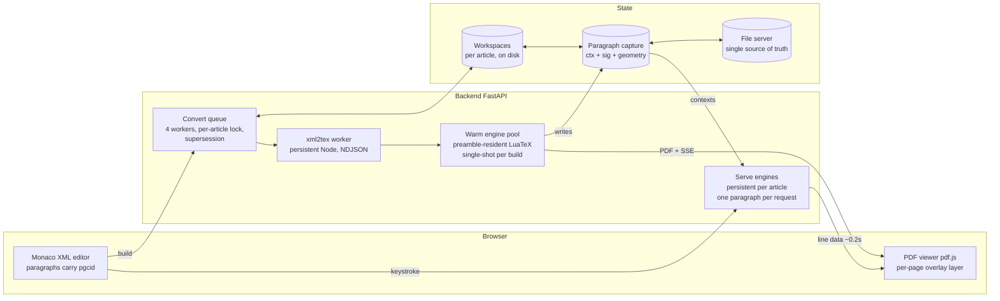
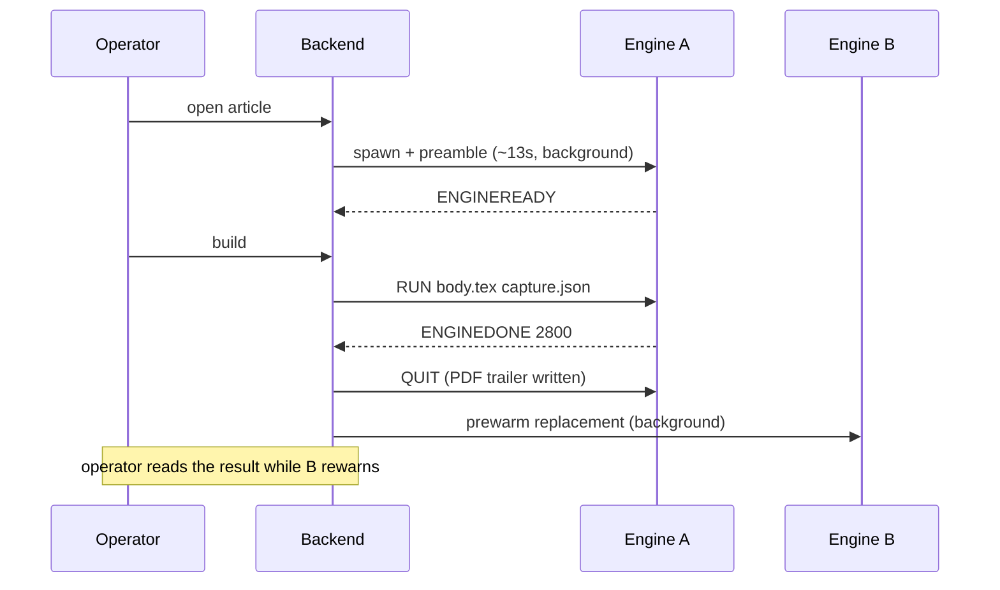
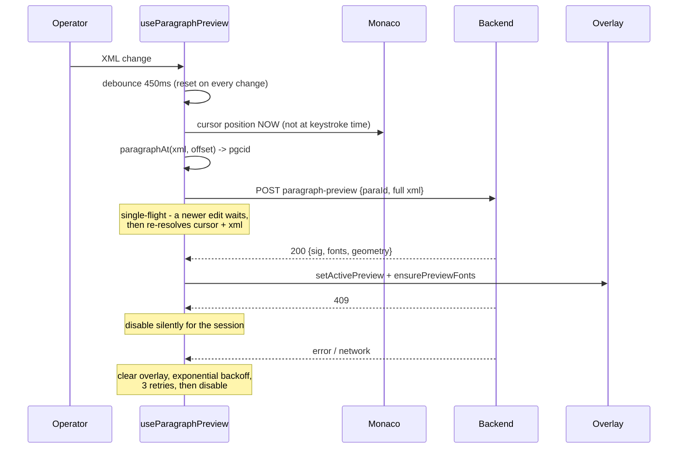

# The Warm Pipeline — Engineering Guide

**Audience:** engineers extending the PGC Editor implementation or porting this
architecture to another platform (a different editor, a different converter, a
different document pipeline built on LuaLaTeX).

**Status:** describes the implementation on `mr-bean` branch
`feature/warm-pipeline` as of July 2026 (Phases 1–2d complete, verified on
production articles). Companion documents:

| Document | What it is |
|---|---|
| `paper/pgc-warm-pipeline.tex` (PDF) | 6-page engineering article — the narrative version of this guide |
| `paper/pgc-warm-pipeline-summary.tex` (PDF) | 2-page executive summary for architecture review |
| `paper/eventually-consistent-page.tex` | the research paper — theory, fidelity methodology, tiered pagination model |
| `docs-production/mr-bean-realtime-architecture.md` | the original survey + phased plan |
| `docs-production/stakeholder-brief.html` | visual brief (artifact) with measured numbers |

This guide is the reference: every protocol byte, every schema field, every
gotcha we hit, and a porting checklist at the end.

---

## Table of contents

1. [Theory: why this works at all](#1-theory-why-this-works-at-all)
2. [System overview](#2-system-overview)
3. [The warm build engine](#3-the-warm-build-engine)
4. [The engine pool](#4-the-engine-pool)
5. [The xml2tex warm worker](#5-the-xml2tex-warm-worker)
6. [Stable paragraph identity (pgcid)](#6-stable-paragraph-identity-pgcid)
7. [Paragraph capture](#7-paragraph-capture)
8. [The serve engine](#8-the-serve-engine)
9. [Backend API surface](#9-backend-api-surface)
10. [The frontend](#10-the-frontend)
11. [Concurrency, capacity, multi-tenancy](#11-concurrency-capacity-multi-tenancy)
12. [Configuration reference](#12-configuration-reference)
13. [Correctness and testing](#13-correctness-and-testing)
14. [Operational runbook](#14-operational-runbook)
15. [The full gotcha catalog](#15-the-full-gotcha-catalog)
16. [Porting guide: integrating on another platform](#16-porting-guide-integrating-on-another-platform)
17. [Future work levers](#17-future-work-levers)
18. [File map](#18-file-map)

---

## 1. Theory: why this works at all

### 1.1 The cost anatomy of a LaTeX build

Measured on a real production article (ACS, 10 pages, structure tagging,
OpenType fonts), one cold compile of 18.2 s decomposes as:

| Stage | Cost | Depends on the edit? |
|---|---|---|
| xml2tex process spawn + template parse | 0.7–1.9 s | **no** |
| TeX template preamble (fonts, packages, tagging machinery) | 13.1 s (72%) | **no** |
| Typesetting the document body | ~5 s | partially |
| Result discovery by 2 s polling | up to 2 s | **no** |

Almost everything a build pays is *invariant under the edit*. The architecture
follows directly: keep the invariant work resident in warm processes, pay only
the variant part per build.

### 1.2 The locality principle

Knuth–Plass line breaking is **paragraph-local**: which words land on which
line depends only on the paragraph's own content plus a finite parameter
context (~30 values: `\hsize`, penalties, demerits, the starting font, …).
Page breaking, by contrast, is **global**: where pages break depends on
everything.

Consequences:

- One paragraph can be re-typeset *exactly*, in isolation, in milliseconds —
  if and only if you reproduce its parameter context bit-for-bit.
- Nothing short of a full body run can tell you where pages break.

So the system has two speeds by design: an exact single-paragraph preview in
~0.2 s, and a full warm build in 3–5 s that produces ground truth. The preview
never guesses at pagination; it renders the edited paragraph at its
*last-known* position and flags when its vertical extent changed (meaning the
next build will shift things).

### 1.3 The five design rules

Stated once, used to answer every "what happens when…" question:

1. **Warm state is keyed per article, never per user or globally.**
2. **Warm state is disposable.** Engines, workspaces, captures are caches over
   the file server. Killing any of them costs one slower build, never data.
3. **The cold path is never removed.** Every warm-path miss or failure falls
   back to the original pipeline. Worst case *equals* the old behavior.
4. **Output must be identical, and gated.** A golden cold-vs-warm comparison
   guards the feature flag per customer. Speed never trades against fidelity.
5. **Memory is bounded by counting processes.** Every resident thing has a
   cap, an idle reaper, and lives under an explicit container memory limit.

---

## 2. System overview



Two request paths leave the editor:

- **Build path** (operator presses build): queue → warm xml2tex → warm engine →
  PDF → SSE push. 3–5 s. Produces truth, refreshes the capture.
- **Keystroke path** (operator just types): debounce → resolve pgcid at cursor
  → full warm xml2tex → extract one paragraph's TeX span → serve engine
  re-typesets it in captured context → browser overlays the result. ~0.2–0.5 s.
  Produces an exact preview of one paragraph.

---

## 3. The warm build engine

### 3.1 The idea

A normal `lualatex` run reads preamble + body from a file and exits. A warm
engine reads the **preamble only**, then parks inside the document and waits
for a body over stdin. All the preamble cost (fonts, packages, tagging
machinery — 13 s on heavy templates) is paid before any build asks for it.

### 3.2 The TeX-side loop

The harness ends the preamble with:

```tex
\loop\directlua{ENGINE_ONE()}\ifserving\repeat
```

Each iteration calls a Lua function that **blocks on stdin**. TeX is
suspended mid-document; the process sits at ~0 CPU. When a request arrives,
the Lua side `tex.print()`s the body content, TeX typesets it exactly as if
it had followed `\begin{document}` in a normal run, and control returns to
the loop.

> **Gotcha (historical):** driving the repetition with a *nested* plain-TeX
> `\loop` inside another macro broke in early experiments. Drive the loop from
> Lua (`tex.print` of the next iteration's tokens) or keep the `\loop` at
> top level as above.

### 3.3 Wire protocol

Line-oriented over stdin/stdout. Exhaustive:

| Direction | Message | Meaning |
|---|---|---|
| engine → pool | `ENGINEREADY` | preamble typeset; engine is warm and idle |
| pool → engine | `RUN <bodyfile> [<capturefile>]` | typeset this body; optionally write a paragraph capture |
| engine → pool | `ENGINEDONE <ms>` | body finished shipping pages; elapsed ms for telemetry |
| engine → pool | `ENGINEERR <msg>` | request malformed / body failed |
| engine → pool | `ENGINELOG <msg>` | non-fatal diagnostics (e.g. capture failures) — **must be surfaced to logs**, not swallowed |
| pool → engine | `QUIT` (or stdin EOF) | fall through the loop to `\end{document}` |

**`QUIT` is not process kill.** Letting the loop fall through to
`\end{document}` runs the engine's normal shutdown — which is what writes the
PDF cross-reference table and trailer. A killed engine leaves a truncated,
invalid PDF; a quit engine leaves a valid one.

### 3.4 Plumbing rules (each one cost us real debugging time)

1. **Drain stdout to EOF, always, from a dedicated thread.** LuaTeX writes its
   log chatter to stdout. A full pipe blocks the process — including during
   the shutdown that finalizes the PDF. Every engine gets one reader thread
   from spawn to EOF. Never two threads on one pipe (they race and interleave
   partial lines); never zero.
2. **Drain stderr too** (bounded tail is fine — keep the last ~400 lines for
   diagnostics).
3. **Capture paths must be relative to the engine's working directory.**
   LuaTeX's paranoid file-open setting (`openout_any=p`, common in
   distributions) silently rejects *absolute* output paths. The engine writes
   nothing and nothing errors. Pass `foo-capture.json`, not
   `/abs/path/foo-capture.json`.
4. **Production templates may `nil` Lua's `debug` library.** Don't rely on
   `debug.getinfo` to locate your own Lua files; resolve paths via `kpse` or
   embed them from the host side.
5. **Body split point:** split the generated `.tex` at `\begin{document}`.
   Hash the preamble (plus customer + article key) to form the *preamble key*;
   a build can only use a warm engine whose preamble key matches. A template
   or preamble change simply misses the pool and runs cold once.

### 3.5 Why build engines are single-shot

The obvious design — one resident engine serving many bodies — **fails on real
templates.** Production float machinery, structure tagging, and Lua-side
bookkeeping leak state across body re-runs. Observed concretely: the second
body run through the same engine silently **lost figure pages**. Snapshotting
and restoring TeX registers was not sufficient: the state lives partly in Lua
tables owned by the template.

Decision: an engine serves **exactly one `RUN`**, then quits; a replacement
prewarms in the background. Every build gets first-run semantics *by
construction*. Warm output was verified byte-identical to a fresh cold compile
before the flag ever went on.

The single-shot cost is hidden by prewarming (see §4). Note the contrast with
serve engines (§8), which are multi-shot — safely, because they never ship
pages.

---

## 4. The engine pool

- **Keying:** `customer/JIDaid` → at most one engine per article, plus the
  preamble-key check at take-time.
- **Prewarm triggers:** (a) operator opens an article (`GET main.xml` hook);
  (b) immediately after every build. Both are fire-and-forget daemon threads.
- **Capacity:** at most `WARM_MAX_ENGINES` (default 6). When full, prewarm
  evicts the least-recently-touched warm engine; if every slot is still
  warming, the prewarm is skipped (logged, not an error).
- **Reaper:** engines idle > `WARM_ENGINE_IDLE_SECONDS` (default 900) are
  quit. Workspaces idle > 24 h are removed (cap 50).
- **Miss semantics:** a pool miss is **never an error** — the build runs cold
  (exactly the legacy path) while a fresh engine warms behind it.
- **Workspaces:** each article gets a persistent scratch directory holding the
  generated `.tex`, aux files, and the capture JSON. Aux files *converge*
  across builds (references stable from the first warm build). The workspace
  also lets captures survive backend restarts: at next article open, an
  existing `{stem}-warm-capture.json` is re-registered.

Timeline of the common case:



---

## 5. The xml2tex warm worker

### 5.1 Why full conversion, not paragraph-only

The converter is **document-scoped**: numbering, counters, cross-reference
context, satellite-driven configuration, and template processors that inspect
siblings/ancestors all shape a paragraph's TeX. Converting an isolated `<p>`
would produce *almost*-right TeX — and the preview's entire value is that its
line breaks are engine-exact, which requires the fragment's bytes to be
identical to a real build's. So every preview converts the **whole document**
with the **real converter**, then extracts one paragraph from the result.

### 5.2 Where the speed comes from

The per-document transform was never the slow part:

| Cold cost (paid every build in the legacy path) | Eliminated by |
|---|---|
| Node process spawn + V8 startup (100–200 ms) | resident process |
| `require()` of the converter module graph | loaded once |
| Parsing/compiling the customer template spec | parsed once, cached |
| V8 running cold (no JIT warmup) | JIT-warm after a few requests |
| **The actual transform: ~300–500 ms** | **still paid — this is the floor** |

Result: 0.7–1.9 s + spawn → 0.3–0.5 s per conversion.

### 5.3 Worker protocol and discipline

- Persistent Node process; requests/replies are newline-delimited JSON over
  stdin/stdout (`{id, xmlPath, customer, options}` → `{id, ok, outputPath | error}`).
- **stdout is reserved for protocol frames.** The worker redirects `console.*`
  to stderr at startup, so chatty vendor/template code cannot corrupt a reply.
- **One dedicated reader thread** owns the pipe on the Python side (same rule
  as engines). stderr is drained continuously into a bounded deque for
  diagnostics.
- **Self-recycling:** after `XML2TEX_WORKER_MAX_RSS` bytes or
  `XML2TEX_WORKER_MAX_REQS` requests, the worker is replaced. A slow leak in
  vendor code resets harmlessly; the next request pays one respawn.
- Preview conversions write to *preview-suffixed* files
  (`{stem}-preview.xml/.tex`) so the article's real artifacts are never
  touched by keystrokes.

---

## 6. Stable paragraph identity (pgcid)

Everything per-paragraph depends on one invariant: **a paragraph keeps its id
across edits and sessions.**

- The converter's own numbering (`paragraphNumberingProcessor` in xml2tex2.0)
  is *idempotent*: ids present in the input XML are preserved; only unnumbered
  paragraphs get fresh ids, assigned above the current maximum ("top-up").
- We exploit this by **stamping ids at load time, in the backend**, before the
  operator ever sees the XML. The converter then finds every paragraph already
  numbered and changes nothing — proven by parity test: 47/47 ids identical to
  the vendor processor's own output on a real article.
- The stamper is **string-based**: it inserts attributes into the raw XML text
  without parsing/re-serializing a DOM, so untouched bytes stay untouched
  (whitespace, entities, attribute order — everything). Comments, CDATA
  sections and processing instructions are masked during the scan so nothing
  inside them is ever stamped. Self-closing `<p/>` elements are stamped too
  (the vendor processor does — parity requires it).
- The stamped file is **persisted atomically before it is served**, so the
  editor, converter, and capture all agree on identity from the first
  keystroke.
- Stability under insertion: inserting a new paragraph shifts **0/46** existing
  ids (the new one gets max+1). Naive renumbering would shift 39/46 — which
  would invalidate every capture entry after the insertion point.

**Porting note:** if your converter's numbering is *not* idempotent, this is
the first thing to build — either fix the converter (in xml2tex 1.x it is a
~5-line change plus an un-awaited `shouldReprocess()` bug) or introduce your
own stable attribute that the converter provably passes through.

---

## 7. Paragraph capture

A warm build is a measurement opportunity: the engine typesets every paragraph
anyway, so recording *how* costs ~nothing. The capture module hooks three
points in LuaTeX's callback pipeline.

### 7.1 The three hooks

**Hook 1 — before line breaking** (`pre_linebreak_filter`, plus the
`insert_local_par` callback to catch the paragraph's start):

Records the full line-breaking context. The exact parameter set (31 keys, from
a live capture):

```
adjdemerits  adjustspacing  baselineskip  doublehyphendemerits
emergencystretch  exhyphenpenalty  finalhyphendemerits  font_name
font_size  hangafter  hangindent  hsize  hyphenpenalty  indent  lang
leftskip  lhmin  linepenalty  lineskip  lineskiplimit  looseness
parfillskip  parshape  pretolerance  protrudechars  rhmin  rightskip
spaceskip  tolerance  uchyph  xspaceskip
```

Notes:
- `font_name` is the **full luaotfload spec**, features included (e.g.
  `[.../texgyretermes-regular.otf]:mode=node;script=latn;+tlig;+kern;`) —
  features change glyph widths and therefore line breaks.
- `baselineskip`/`lineskip`/`lineskiplimit` are glue specs
  `[width, stretch, shrink, stretch_order, shrink_order]`. They matter because
  the serve engine's `\vbox` must inter-line-glue its lines exactly as the
  page did.
- The paragraph is attributed to its pgcid via a **TeX attribute** set by the
  `\paraid{...}` macro the converter emits.

**Hook 2 — after line breaking** (`post_linebreak_filter`):

Records the **line signature**: per line `{y, h, w, d, g}` where `g` is a
glyph array `[charCode, xOffsetSp, fontId]`. Positions are measured with
`node.dimensions` — the engine's own arithmetic — so microtype font expansion
is included to the scaled point.

> **Gotcha:** naive accumulation of glyph widths is off by up to ±6.5 pt under
> microtype. `node.dimensions` per node is the engine's answer; if you must
> compute manually, glyph expansion is `width × (1 + expansion_factor/1e6)`
> but a kern's `expansion_factor` is an **absolute sp correction**, not a
> ratio.

> **Gotcha (attribute stickiness):** TeX attributes persist until changed.
> Left alone after a paragraph ends, the pgcid attribute bleeds into whatever
> the output routine contributes next — running heads and folio digits
> inherited the last paragraph's id and corrupted its bounding box. **Reset
> the attribute explicitly after each paragraph's post-linebreak processing.**

**Hook 3 — at shipout** (`pre_shipout`):

Walks the finished page with absolute coordinates and records per paragraph:
`page` (number), `origin` `[xSp, ySp]` (first baseline position, page top-left
origin), `bbox` `[minX, minY, maxX, maxY]`, and `split` (true if the paragraph
crosses a column/page).

> **Gotcha (the vertical-walk rule):** while walking a vertical list,
> vertical advance is accumulated as **height + depth of boxes and resolved
> glue**. `node.dimensions` on a vlist answers a different question and gives
> wrong positions. This is the single most common porting bug.

### 7.2 Capture JSON schema

Written to `{workspace}/{STEM}-warm-capture.json`:

```jsonc
{
  "paras": {
    "para10": {
      "ctx":    { /* the 31 parameters above */ },
      "sig":    [ { "y": 0, "h": 447611, "d": 142868, "w": 31772590,
                    "g": [[80, 0, 95], [108, 32768, 95], ...] }, ... ],
      "page":   3,
      "origin": [3683779, 38192784],
      "bbox":   [3683779, 37745173, 35292532, 45386671],
      "split":  false
    }
  },
  "pages":  [ { "w": 39158276, "h": 52211034 }, ... ],
  "fonts":  { "95": { "name": "<luaotfload spec>", "size": 655360 } }
}
```

All positional units are **sp** (65536 sp = 1 TeX pt). `sig[].y` values are
relative to the first baseline (line 1 has `y: 0`); `origin` is absolute on
the page. Font `size` is the *scaled* size in sp.

---

## 8. The serve engine

### 8.2 Multi-shot, and why that is safe here

The serve engine makes the **opposite** trade from the build engine: one
process serves thousands of requests. Safe because each request typesets one
paragraph inside

```tex
\setbox0=\vbox{ <context prologue> <paragraph> \par }\directlua{SERVE_RESPOND()}
```

A box that is **never shipped out** engages no page builder, no float
placement, no output routine, no marks — none of the machinery that made build
engines leak (§3.5). The box is measured, reported, and discarded.

### 8.2 Protocol

| Direction | Message |
|---|---|
| engine → server | `SERVEREADY` (after preamble + aux transplant) |
| server → engine | one request per line: a Lua table literal `{text=..., ctx=...}` |
| engine → server | one JSON line: `{sig: [...], fonts: {...}}` or `{error: ...}` |

### 8.3 Context injection

The request's `ctx` (the captured 31 parameters) is compiled into TeX
assignments *inside* the `\vbox`, before the paragraph text: every penalty and
demerit, the glue specs, `\hsize`, and a font switch to the captured
`font_name`/`font_size`. The line breaker then sees the paragraph exactly as
the full build did → identical breakpoints, identical glyph positions, to the
scaled point.

### 8.4 Aux transplant

Paragraphs containing `\ref`/`\cite` must resolve without loading the
document. At engine start, the workspace's **converged aux file** is parsed
and each `\newlabel`/`\bibcite` is installed directly into engine memory via
`token.set_macro("r@...")` / `token.set_macro("b@...")`.

> **Gotcha:** feeding `\newlabel` lines through TeX mid-document is refused by
> LaTeX. `token.set_macro` bypasses that cleanly.

### 8.5 Response comparison and `profileChanged`

The engine's fresh `sig` is compared to the captured one by **vertical
profile**: the sequence of per-line `(h, d)` relative to the first baseline.

- Equal profile → the edit *provably* cannot move anything else on any page
  (the paragraph occupies the same vertical skeleton).
- Different → response carries `profileChanged: true`; the client shows the
  preview anyway plus a "layout will shift — rebuild to settle" hint.

> **Gotcha:** compare profiles **first-baseline-relative**. Reference
> signatures from the page carry leading interline glue that a `\vbox`
> re-typeset cannot reproduce; absolute `y` comparison always mismatches.

### 8.6 Lifecycle

Per-article, cap `SERVE_ENGINES` (default 4), LRU eviction, idle reaper.
Two concurrency rules learned the hard way:

- **Spawn outside the registry lock.** A serve spawn costs ~9 s (preamble).
  Holding the global registry lock during it blocked *other articles'*
  previews. Pattern: per-article spawn locks; the registry lock is held only
  for map reads/writes; eviction victims are killed outside the lock too.
- **Prewarm at article open** (alongside the build engine and capture
  re-registration), so the operator's first keystroke pays ~0.5 s, not ~9 s.

### 8.7 Sanitization

The extracted paragraph span is sanitized before typesetting: `\end{document}`,
`\endinput`, `\dump`, `\input`/`\include` are stripped. A half-typed edit must
never wedge the engine; if one does anyway, the engine is respawned and the
*next* preview succeeds (verified by the test battery's engine-kill scenario).

---

## 9. Backend API surface

| Endpoint | Method | Purpose | Warm-specific behavior |
|---|---|---|---|
| `/dataset/{jid}/{aid}/main.xml` | GET | serve article XML | stamps pgcid (persist-before-serve); triggers prewarm (engine + serve + capture re-registration) |
| `/convert` | POST | enqueue a build | routes to warm engine on preamble-key hit; cold fallback; supersession |
| `/jobs/{id}` | GET | job status + `JobTimings` | |
| `/events` | GET (SSE) | job lifecycle push | replaces 2 s polling |
| `/dataset/{jid}/{aid}/paragraphs` | GET | per-pgcid geometry from the capture | 409 until a capture exists |
| `/dataset/{jid}/{aid}/paragraph-preview` | POST `{paraId, xmlData}` | the keystroke path | 409 = no capture / warm off (client disables for session); 502 = runtime failure |
| `/dataset/{jid}/{aid}/preview-font/{fontId}` | GET | serve a typeface referenced by a preview | resolved server-side by engine font id — the client never supplies a path |
| `/metrics` | GET | Prometheus text | `pgc_compile_stage_ms{path=warm|cold}`, `pgc_warm_events_total{event=hit|miss|fallback}`, `pgc_warm_engines`, `pgc_jobs_total` |

**Supersession:** each article key tracks its newest queued job. A job checks
whether it is superseded *before and after* acquiring the per-article dataset
lock; superseded jobs return `error_tool="superseded"` without compiling.
Operators who mash the build button cost one compile, not five.

Preview response schema (what the overlay consumes):

```jsonc
{
  "paraId": "para10",
  "sig":    [ /* same line-signature format as the capture */ ],
  "fonts":  { "95": { "name": "...", "size": 655360 } },  // no file paths
  "page": 3, "origin": [x, y], "bbox": [x0, y0, x1, y1],
  "split": false, "profileChanged": false,
  "timings": { "xml2TexMs": 331.0, "paragraphMs": 19.9, "totalMs": 502.1 }
}
```

---

## 10. The frontend

### 10.1 The keystroke state machine



Key behaviors:

- **Cursor is resolved at debounce-fire time**, so the preview follows the
  operator if they moved during the wait.
- **`paragraphAt`** is a dependency-free string scan (quote-aware tag
  boundaries; skips comments/CDATA/PIs; innermost `<p pgcid>` wins). No DOM
  parse per keystroke.
- **Single-flight:** at most one request in the air; a newer edit re-resolves
  the latest cursor/XML after the in-flight one settles — requests never stack.
- **Disable policy:** a 409 (feature off / no capture) disables previews for
  the browser session, silently. Three consecutive transport errors do the
  same after exponential backoff. *Operational consequence: after a backend
  restart, reload the tab* (see runbook §14).
- **Clearing:** the overlay clears when a build lands (the PDF beneath is now
  truth) and on article switch.

### 10.2 Overlay rendering math

All engine coordinates are TeX sp; the viewer's `zoom` is px per **PDF point**.

```
px = sp / 65536            // sp -> TeX pt
   * (72 / 72.27)          // TeX pt -> PDF pt   <- do not skip this
   * zoom                  // PDF pt -> px
```

> **Gotcha:** skipping the 72/72.27 factor (0.37%) looks fine near the page
> top and drifts the overlay visibly **down** the page (~2 px mid-page at
> zoom 1) because absolute y-coordinates are large.

Anchoring — the paragraph's first glyph lands exactly on the captured origin,
everything else is relative to that anchor:

```
x0 = origin.x - sig[0].g[0].x      // first glyph's own offset removed
y0 = origin.y - sig[0].y           // sig y-values are first-baseline-relative
glyph position = (x0 + glyph.x, y0 + line.y)
mask top    = origin.y - sig[0].h
mask bottom = y0 + last.y + last.d
mask left/right = bbox
```

### 10.3 Baseline-exact text: use SVG

> **Gotcha (the "slightly low text" bug):** CSS has no baseline-positioning
> primitive. Absolutely-positioned HTML spans with `line-height: 0` collapse
> to zero height, so `translateY(-100%)` is a no-op and the browser
> effectively centers glyphs on the target line — text sits ~0.3 em low.

SVG `<text y=...>` anchors at the **true alphabetic baseline** natively.
Implementation details that matter:

- One `<text>` per **same-font run** per line, with a per-character `x` list
  (`x="12.3 19.8 26.1 ..."`) — exact per-glyph positioning, few DOM nodes.
- Spaces render as NBSP (` `): SVG whitespace collapsing would silently
  desync the x list.
- Characters outside the BMP get a **solo** `<text>`: engines disagree on
  whether the x list indexes code units or code points.
- Control/unmappable char codes render as `·` rather than raw control chars.

### 10.4 Real typefaces

- The serve engine reports each used font's **file path**
  (`font.getfont(id).filename` — luaotfload already resolved it when the
  template loaded the font). Fully template-agnostic: no per-template font
  configuration exists anywhere.
- The backend keeps a per-article `fontId -> path` registry (merged across
  previews) and serves bytes at `preview-font/{id}`. Paths never come from the
  client; paths never go to the client.
- The browser loads each font once as a `FontFace` under a deterministic
  family (`pgc-prev-{jid}-{aid}-{id}`), then SVG runs reference that family
  with a serif fallback. First paint is exact-position fallback; letterforms
  snap to the real face when it loads (~one fetch per font per day, cached).
- Failure mode: a 404/unloadable font (engine respawned, legacy Type1 .pfb)
  leaves the fallback in place at exact positions. Nothing breaks.

---

## 11. Concurrency, capacity, multi-tenancy

**Everything warm is keyed per article.** The multi-user matrix:

| Situation | Behavior | Operator sees |
|---|---|---|
| N operators, different articles, simultaneous builds | parallel up to 4 build workers, each against its own warm engine | 3–5 s each |
| Two operators, same article | per-article dataset lock serializes; supersession keeps newest | one compile, newest wins |
| Open articles > engine slots (6) | LRU eviction; evicted article's next build runs cold once while re-warming | one ~20 s build, then 3–5 s |
| Previewing articles > serve slots (4) | LRU; replacement spawns **outside** the shared lock | first preview ~0.5 s, then ~0.2 s |
| Idle 15 min / overnight | reapers reclaim engines; workspace survives 24 h | memory freed, next open prewarms back |
| Crash / restart / OOM-kill | warm state disposable; captures re-register from workspace at next open | one slower build, never data loss |

**Memory model:** a fully warm heavy-template article ≈ 2–3 GB (build engine
0.3–1.5 GB + serve engine + worker share). Defaults (6 build + 4 serve
engines, 12 GB container `mem_limit`) are sized so the worst case fits.
Capacity planning is `concurrently-active articles × 2–3 GB` — **by article,
not by user**.

**Scale-out:** nothing warm is shared between articles, so sharding is
sticky-routing by article id; each backend owns its warm set; the shared file
server stays the single source of truth.

**Shared resources (the only globals):** 4 build workers (`MAX_WORKERS`,
unchanged from legacy), 1 xml2tex worker (serialized, but 0.3–0.5 s per
conversion — never the queue), one memory envelope.

---

## 12. Configuration reference

All read from the environment at process start (restart required to change).

| Variable | Default | Meaning |
|---|---|---|
| `WARM_ENGINES` | `0` | master flag; `1` enables the entire warm pipeline |
| `WARM_WORKSPACE_ROOT` | `/var/cache/pgc-editor/workspaces` | per-article scratch dirs (container-local unless volume-mounted) |
| `WARM_MAX_ENGINES` | `6` | build-engine pool cap |
| `WARM_MAX_WORKSPACES` | `50` | workspace cap (LRU) |
| `WARM_ENGINE_IDLE_SECONDS` | `900` | build/serve engine idle reap |
| `WARM_WORKSPACE_IDLE_SECONDS` | `86400` | workspace idle reap |
| `WARM_ENGINE_READY_TIMEOUT_SECONDS` | `120` | max preamble warm time before the spawn is abandoned |
| `XML2TEX_WORKER` | `1` | persistent converter worker on/off |
| `XML2TEX_WORKER_MAX_RSS` / `_MAX_REQS` | — | worker recycling thresholds |
| `PGCID_STAMPING` | `1` | load-time paragraph id stamping (2.0 customers) |
| `PARA_CAPTURE` | `1` | capture during warm builds |
| `SERVE_ENGINES` | `4` | serve-engine cap (LRU) |
| `MAX_WORKERS` | `4` | build worker threads (legacy, unchanged) |
| `COMPILE_TIMEOUT_SECONDS` | `180` | per-compile ceiling |
| `BACKEND_MEM_LIMIT` (compose) | `12g` | container memory ceiling |

> **Deployment gotcha:** if you run from an alternate compose file
> (`docker-compose-local.yml` etc.), the `environment:` passthrough block must
> exist in *that* file too. A recreated container without these vars runs the
> legacy cold path **silently** — builds work, they're just slow, and
> `paragraph-preview` 409s. First diagnostic: check the container env, not the
> code.

---

## 13. Correctness and testing

- **Golden gate:** the same article is compiled cold and warm; the generated
  `.tex` must be equivalent (one known timestamp normalized) and the PDFs must
  have identical text content. This gates the flag per customer.
- **Fidelity method (research phase):** glyph-position comparison to **zero
  scaled points** across four template families (elsarticle, IEEEtran, acmart,
  cas-dc): 10/12 body paragraphs byte-exact per template; the two exceptions
  are the predicted footnote/display-math boundaries.
- **Unit suite:** 33 tests (`backend/tests/test_warm_pipeline.py`) covering
  split/keying, stamper parity and masking, supersession, capture indexing,
  preview orchestration; plus a golden e2e test gated by
  `PGC_GOLDEN_DATASET=customer:jid:aid` runnable against any dataset copy.
- **Preview battery:** `scripts/preview-smoke.py` — 14 scenarios: unmodified
  parity (exact glyph positions), growth edits + `profileChanged`, 10
  sequential previews (latency stability), multiple paragraphs, unknown id,
  hostile mid-edit input, engine-death recovery. All against a **copy** of a
  production dataset; production data is never touched by tests.
- **Runtime canary:** `pgc_warm_events_total{event="fallback"}` — the rollout
  health signal. Rising fallback = warm path failing somewhere while operators
  silently get correct-but-slow builds.

**Known boundaries (by design):** paragraphs whose typesetting depends on
machinery a `\vbox` cannot reproduce are not eligible for preview — footnotes,
display math, list items, float captions (the wrapper macro switches fonts
mid-stream). They take the 3–5 s build path. Detect-and-route-explicitly is a
future lever.

---

## 14. Operational runbook

### After any backend restart

1. **Reload the browser tab.** The preview hook disables itself for the
   session after 409s/errors (which naturally occur while the backend is
   down). The flag lives in the page; only a reload resets it.
2. **Open the article; run one build** if the container was *recreated*
   (fresh filesystem → no capture). A plain stop/start keeps workspaces, and
   opening the article re-registers the capture automatically.
3. Type in a paragraph → overlay in ~0.2–0.5 s.

Restart order: **backend first, browser reload last.**

### 30-second diagnosis

```bash
# flags actually present in the running container?
docker inspect mr-bean-backend --format '{{range .Config.Env}}{{println .}}{{end}}' \
  | grep -E "WARM_ENGINES|PARA_CAPTURE|SERVE_ENGINES"

# builds hitting the warm path?
curl -s localhost:18080/metrics | grep warm_events

# engines resident right now?
docker exec mr-bean-backend sh -c 'ps aux | grep -c [l]ualatex'

# capture present for an article?
docker exec mr-bean-backend ls /var/cache/pgc-editor/workspaces/<cust>/<JIDaid>/
```

Browser Network tab, `paragraph-preview` request:
**200** = working · **409** = no capture yet (build once, then reload tab) ·
**no request at all** = session-disabled (reload tab).

### Symptom table

| Symptom | Cause | Fix |
|---|---|---|
| Builds 12–25 s, no warm events in metrics | flag/env missing in container (wrong compose file, stale container) | fix env, recreate container |
| First build after open ~20 s, rest fast | prewarm hadn't finished — by design | none; or wait ~15 s after open |
| Preview 409 forever | no capture (recreated container, never built) | one build |
| Preview worked, then silently stopped | session disable after backend restart | reload tab |
| Overlay text slightly below print | missing 72/72.27 pt conversion, or HTML-span baseline hack | use SVG text + the factor (§10) |
| Engine wrote no capture, no error | absolute capture path rejected by `openout_any=p` | relative path |
| Backend crash-loop on import | Python-version syntax mismatch (container 3.10 vs dev 3.12 — e.g. backslash in f-string) | `docker exec ... python3 -m compileall /app/app` before shipping |
| PDF truncated/invalid from warm build | engine was killed instead of QUIT, or stdout not drained during shutdown | graceful quit + reader thread to EOF |

---

## 15. The full gotcha catalog

Condensed, hard-won, in one place. Engine-side:

1. Single-shot build engines: template float/tagging state leaks across body
   re-runs (run 2 lost figure pages); register snapshots insufficient.
2. QUIT, don't kill: `\end{document}` writes the PDF trailer.
3. One dedicated stdout reader thread per process, spawn to EOF; bounded
   stderr drain. Full pipes block engines, two readers race.
4. `openout_any=p` rejects absolute output paths silently → relative paths.
5. Templates may nil `debug`; locate Lua files via kpse/embedding.
6. Nested plain-TeX `\loop` for the serve loop breaks; keep it top-level.
7. Preamble format dump (`\dump` + custom format) fails under luaotfload
   (66 MB format, no output) — warm *processes*, not format files.
8. `\paraid` must be **chained** (wrap the template's own definition), not
   replaced — production templates define it themselves.

Measurement-side:

9. `node.dimensions` for horizontal glyph positions (microtype-exact); manual
   accumulation is ±6.5 pt off. Kern `expansion_factor` is absolute sp.
10. Vertical walks: accumulate h+d of boxes and resolved glue; never
    `node.dimensions` on a vlist.
11. TeX attributes are sticky — reset after each paragraph or folio glyphs
    inherit the id and corrupt bboxes.
12. Compare vertical profiles first-baseline-relative (page lines carry
    interline glue a `\vbox` can't reproduce).
13. Capture `baselineskip`/`lineskip`/`lineskiplimit` — without them the
    serve `\vbox` leading is off by ~0.9 pt.

Converter/identity-side:

14. Full-document conversion for previews; paragraph-isolated conversion
    breaks byte parity (converter is document-scoped).
15. Stamper must mask comments/CDATA/PIs and stamp self-closing `<p/>` too
    (vendor parity).
16. xml2tex 1.x: numbering not idempotent without a small patch; un-awaited
    `shouldReprocess()` re-compiles templates every run.

Frontend-side:

17. sp → pt → **bp** → px; the 72/72.27 factor is not optional.
18. Baseline positioning needs SVG text; CSS spans cannot do it.
19. NBSP for spaces in SVG x-lists; solo runs for non-BMP chars.
20. 409 → session disable means "reload the tab after backend restarts" —
    or soften the policy (re-probe after next successful build).

Deployment-side:

21. Dev venv 3.12 vs container 3.10: syntax that parses locally can crash the
    container (`compileall` inside the container before shipping).
22. Alternate compose files need the env passthrough too; a container without
    the flags degrades **silently** to cold.
23. uvicorn without `--reload` + bind-mounted code = new code only on
    container restart; `docker compose restart` does not re-read compose env
    (recreate via `up -d` for env changes).

---

## 16. Porting guide: integrating on another platform

### 16.1 What is generic vs. what is TNQ-specific

**Generic (port as-is):**
- The warm-engine harness + protocol (§3) — works with any LuaLaTeX document
  that splits at `\begin{document}`.
- The pool/prewarm/reaper/fallback pattern (§4).
- The capture module's three hooks and schema (§7) — pure LuaTeX callbacks.
- The serve engine (§8) — context injection, aux transplant, profile compare.
- The overlay math and SVG rendering (§10).
- The concurrency model (§11) and all of §15.

**Platform-specific (re-implement per platform):**
- The converter warm-ification (§5): whatever produces TeX from your source
  format needs its own "load once, transform many" server wrapper. The NDJSON
  discipline transfers; the internals don't.
- Paragraph identity (§6): you need *some* stable id that survives your
  converter — attribute stamping, block ids, CMS node ids.
- The paragraph wrapper markup: we locate spans by `\paraid{...}`; your
  converter must emit *something* findable around each unit of text.
- Editor integration: cursor→id resolution is format-specific (our string
  scan is XML-specific).

### 16.2 The five contracts a port must satisfy

1. **Splittable output:** generated TeX separates into (preamble, body) at a
   deterministic point, and the preamble is stable across small edits.
2. **Stable unit identity:** every editable unit (paragraph) has an id that is
   identical in the source, in the generated TeX, and across edits/sessions.
3. **Locatable spans:** given an id, the unit's TeX span can be extracted from
   the generated TeX by string search (converter emits delimiting markup).
4. **Deterministic converter:** same source → same TeX bytes (or the golden
   gate cannot work).
5. **A file-server source of truth** that survives the death of everything
   warm.

If you can satisfy those five, everything else in this guide follows
mechanically.

### 16.3 Suggested build order (matches our phase structure)

1. **Phase 1 — warm builds:** split/keying, harness, pool, prewarm-on-open,
   converter worker, golden gate, metrics, flag + cold fallback.
   *Exit criterion: golden-identical output, 3–6× faster builds.*
2. **Phase 2a — identity:** stamping/parity with your converter's numbering.
   *Exit criterion: N/N id parity on a real document; 0 shifts on insertion.*
3. **Phase 2b — capture:** the three hooks; verify against real pages
   (attribute reset! vertical-walk rule!).
   *Exit criterion: every body paragraph captured with correct page/origin/bbox.*
4. **Phase 2c — serve engine:** context injection, aux transplant, parity
   battery (aim: exact glyph positions on unmodified paragraphs).
5. **Phase 2d — overlay:** SVG rendering, debounce/single-flight, fonts.

Do not skip the golden gate or the battery — every shortcut here surfaced a
real bug for us (folio attribute bleed, vbox leading, pt/bp drift, span
baseline hack).

### 16.4 Sizing a new deployment

- Measure one article's warm footprint on *your* templates (ours: 2–3 GB
  heavy, 0.3 GB light).
- `WARM_MAX_ENGINES + SERVE_ENGINES` × footprint < container limit, with
  headroom for the cold path (which still runs on misses).
- Start flag-off; enable per customer behind the golden gate; watch the
  fallback counter.

---

## 17. Future work levers

Ordered by measured impact:

1. **Conversion caching for previews** — xml2tex dominates preview latency
   (~400 of ~500 ms). Skip conversion when nothing outside the edited
   paragraph changed → previews at ~50–100 ms. Optimization, not redesign.
2. **Explicit boundary routing** — detect cursor-in-footnote/display-math and
   tell the operator, instead of silently taking the build path.
3. **Images/rules in the preview region** — the capture already records where
   they are; the overlay could draw placeholders or crops.
4. **Background convergence over SSE** — push fresh page geometry as builds
   complete, realizing the full tiered model of the research paper.
5. **Softened session-disable** — re-probe previews after the next successful
   build instead of requiring a tab reload.
6. **Workspace volume** — persist workspaces across container recreates so
   even those keep captures warm.

---

## 18. File map

```
mr-bean (branch feature/warm-pipeline)
├── backend/app/
│   ├── compiler.py                 # worker pool, warm routing, WarmRuntime,
│   │                               #   prewarm_article, supersession, serve registry
│   ├── config.py                   # all env knobs (§12)
│   ├── main.py                     # endpoints (§9), pgcid stamping hook, SSE
│   ├── job_store.py                # JobEventBus, DatasetLockRegistry
│   └── warm/
│       ├── engine_pool.py          # split_tex, preamble_key, WarmEngine, EnginePool
│       ├── warm-engine.lua         # build-engine harness (§3)
│       ├── capture-mrbean.lua      # the three hooks (§7)
│       ├── serve-mrbean.lua        # serve engine (§8)
│       ├── serve_engine.py         # serve process wrapper
│       ├── preview.py              # keystroke orchestrator (§5.1, §8)
│       ├── pgcid.py                # load-time stamper (§6)
│       ├── workspace.py            # WorkspaceManager
│       ├── xml2tex_worker.js       # persistent converter worker (§5)
│       ├── xml2tex_client.py       # NDJSON client, reader thread, recycling
│       └── metrics.py              # stdlib Prometheus text
├── backend/tests/test_warm_pipeline.py
├── scripts/warm-smoke.py           # cold-vs-warm golden harness
├── scripts/preview-smoke.py        # 14-scenario preview battery
└── frontend/src/
    ├── utils/paragraphAt.ts        # cursor offset -> pgcid
    ├── utils/previewFonts.ts       # FontFace loading (§10.4)
    ├── hooks/useParagraphPreview.ts# debounce / single-flight / disable
    ├── services/api/paragraphPreviewApi.ts
    ├── types/paragraphPreview.types.ts
    └── components/pdf/ParagraphPreviewOverlay.tsx  # SVG overlay (§10.2-10.3)

realtime-luatex-research (branch production-flow)
├── prototype/                      # the research reference implementation
├── paper/                          # both articles + TikZ figures
└── docs-production/                # architecture docs, this guide, brief
```

---

*Prepared from the realtime-luatex-research program and the mr-bean
`feature/warm-pipeline` implementation. All latency figures measured on
production datasets. Questions → Srikanth Mohankumar (TNQ Tech).*
